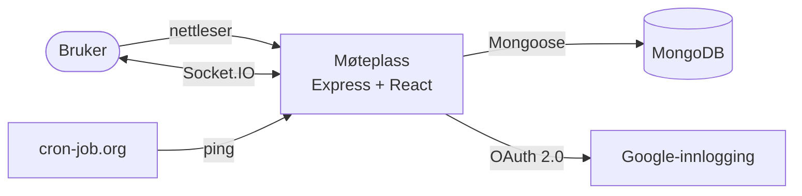
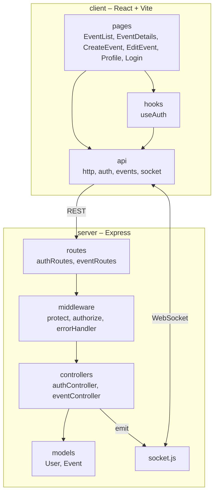
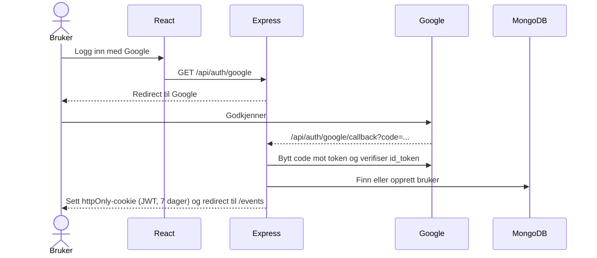
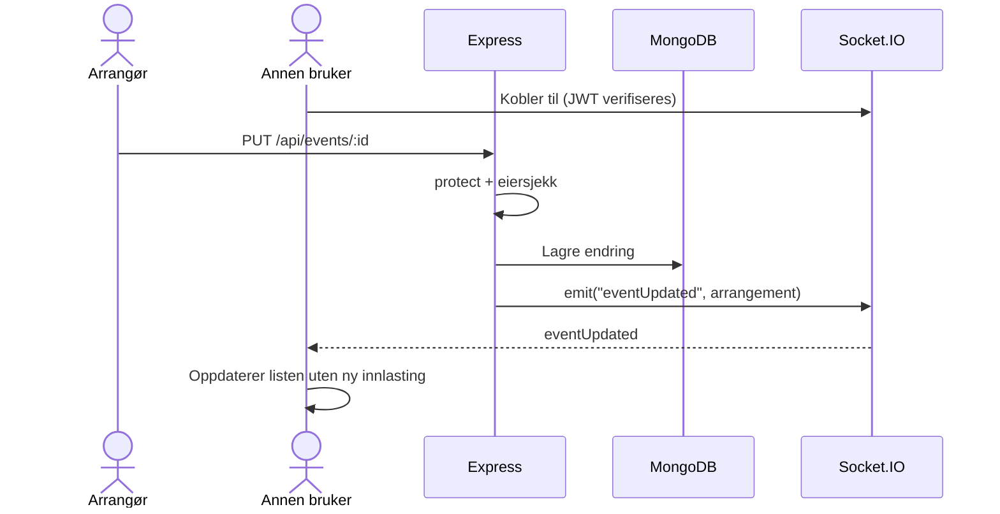
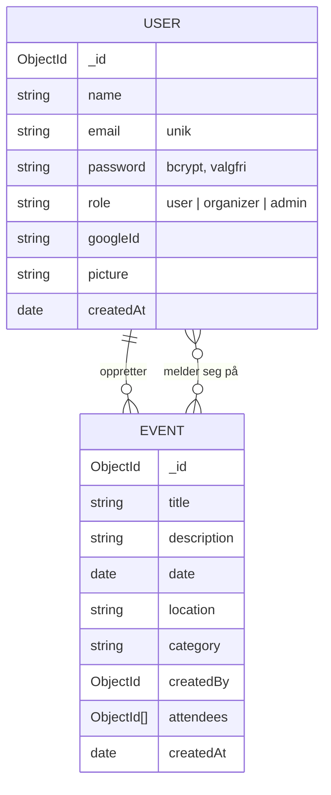

# Møteplass – Arkitektur

Dette dokumentet beskriver hvordan Møteplass er bygget, og hvorfor. Det er ment for utviklere som vil forstå systemet før de leser koden.

## 1. Kontekst og mål

Møteplass er et sted der folk kan finne arrangementer og samles. Arrangører lager arrangementer, og andre kan melde seg på. Endringer vises med en gang hos alle som har siden åpen.

**Mål**
- Endringer skal vises i sanntid uten at brukeren må laste siden på nytt.
- Bare den som har laget et arrangement, eller en admin, kan endre eller slette det.
- Innlogging skal være trygg og enkel, med Google eller e-post og passord.
- Systemet skal kunne driftes gratis.

**Utenfor omfang**
- Betaling for billetter.
- Chat mellom deltakere.

## 2. Krav

| Type | Krav |
|---|---|
| Funksjonelt | Alle kan se arrangementer og detaljer uten å logge inn |
| Funksjonelt | Arrangører og admin kan opprette arrangementer |
| Funksjonelt | Eier eller admin kan endre og slette et arrangement |
| Funksjonelt | Innloggede brukere kan melde seg på og av |
| Funksjonelt | Profilside med egne og påmeldte arrangementer, og profilbilde |
| Ikke-funksjonelt | Sanntidsoppdatering via WebSocket (Socket.IO) |
| Ikke-funksjonelt | Passord hashes med bcrypt, token lagres i httpOnly-cookie |
| Ikke-funksjonelt | Sikkerhetsheadere med Helmet og CORS med liste over tillatte domener |
| Ikke-funksjonelt | Ingen hemmeligheter i koden, kun miljøvariabler |

## 3. Systemkontekst

Express serverer både API-et (`/api/*`) og den bygde React-appen (`client/dist`) fra samme tjeneste. Alle andre stier returnerer `index.html`, slik at React Router tar over.

## 4. Komponenter og lag

| Del | Ansvar |
|---|---|
| **routes** | Kobler URL og HTTP-metode til riktig middleware og controller |
| **middleware** | `protect` leser JWT fra Bearer-header eller cookie. `authorize` sjekker rolle. `errorHandler` gir felles feilsvar |
| **controllers** | Forretningslogikk: eiersjekk, påmelding og sending av sanntidshendelser |
| **models** | Mongoose-skjemaer, validering og passord-hashing |
| **socket.js** | Verifiserer JWT ved tilkobling og sender hendelser til klientene |
| **client/api** | All kommunikasjon med serveren er samlet her, så sidene ikke kjenner til URL-er |

## 5. Tilgangsstyring

| Handling | Krever |
|---|---|
| Se arrangementer | Ingenting |
| Opprette arrangement | Innlogget med rollen `organizer` eller `admin` |
| Endre eller slette | Innlogget og eier av arrangementet, eller `admin` |
| Melde seg på eller av | Innlogget |

Roller: `user`, `organizer` og `admin`. Nye brukere via Google får rollen `organizer`. Brukere som registrerer seg med e-post får rollen `user`.

Rollesjekken skjer i middleware (`authorize`). Eiersjekken skjer i controlleren, fordi den krever at arrangementet er hentet fra databasen først.

## 6. Innlogging og sanntidsflyt

**Innlogging med Google**

**Sanntid når et arrangement endres**

Serveren sender `eventCreated`, `eventUpdated`, `eventDeleted` og `eventRegistrationUpdated`.

## 7. Datamodell

Påmeldte lagres som en liste med bruker-ID-er direkte i arrangementet. Det gjør det raskt å vise antall og deltakere, siden alt hentes i ett oppslag.

## 8. Designbeslutninger

**ADR-1: Én tjeneste for API og frontend**
- *Valg:* Express serverer den bygde React-appen.
- *Alternativ:* Frontend og backend som to separate tjenester.
- *Hvorfor:* Én gratis tjeneste på Render i stedet for to. Samme domene gjør at cookies fungerer uten ekstra CORS-oppsett.

**ADR-2: JWT i httpOnly-cookie**
- *Valg:* Tokenet lagres i en cookie som JavaScript ikke kan lese.
- *Alternativ:* Token i localStorage.
- *Hvorfor:* Et XSS-angrep kan ikke stjele tokenet. Serveren godtar også Bearer-header, som gjør API-et enkelt å teste.

**ADR-3: Socket.IO for sanntid**
- *Valg:* Serveren sender hendelser når data endres.
- *Alternativ:* At klienten spør serveren med jevne mellomrom (polling).
- *Hvorfor:* Endringer vises med en gang, og det blir færre unødvendige forespørsler.

**ADR-4: MongoDB med innebygde lister**
- *Valg:* Deltakere lagres som en liste i arrangementet.
- *Alternativ:* Egen samling for påmeldinger.
- *Hvorfor:* Enkelt og raskt å lese. Det passer så lenge arrangementene ikke har tusenvis av deltakere.

**ADR-5: cron-job.org mot kaldstart**
- *Valg:* Pinge appen hvert 10. minutt på hverdager kl. 07–20.
- *Alternativ:* Betalt plan hos Render.
- *Hvorfor:* Render sin gratisplan sover etter 15 minutter. Pingen holder appen våken når den mest sannsynlig besøkes.

## 9. Testing

- **Server:** Vitest og Supertest mot en MongoDB i minnet (`mongodb-memory-server`). Testene dekker innlogging, arrangementer, profil og tilgang.
- **Klient:** Vitest og Testing Library. Testene dekker sider, skjemaer og `useAuth`.

## 10. Begrensninger og videre arbeid

- **Sanntid til alle:** Hendelser sendes til alle tilkoblede. Rommene `event:<id>` opprettes, men brukes ikke ennå. Neste steg er å sende bare til dem som ser på arrangementet.
- **Profilbilder i databasen:** Bildene lagres som base64 i MongoDB (maks 2 MB). En fillagringstjeneste ville vært bedre ved flere brukere.
- **Store deltakerlister:** Innebygde lister blir tunge ved svært mange påmeldte.
- **Opprydding:** `express-session` og `profileController.js` er ikke i bruk og kan fjernes.
- **Kaldstart:** Utenom hverdager 07–20 kan første besøk ta opptil ett minutt.
